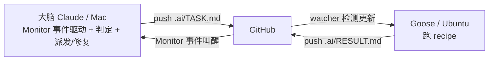

# 实验计划：两节点接力（模拟机械臂 节点1→节点2 / 目标逐级依赖）

**目的**：用最简单的 shell 任务，验证「大脑事件驱动地判定当前节点是否完成 → 完成则推进下一节点，未完成则修复重派」这套编排机制。预演 [[端到端落地路线图 — 六节点 + 工作循环]] 的多节点逐级依赖推进。

**目录约定**：所有中继文件收在 `.ai/` 下——`.ai/TASK.md`（任务）、`.ai/RESULT.md`（结果）、`.ai/PLAN.md`（本计划）、`.ai/supervised-runner.yaml`（recipe）、`.ai/watch-and-run.sh`（watcher）、`.ai/outputs/`（节点产物，gitignore）、`.ai/.state/`（watcher 状态，gitignore）。

**依赖链（每节点读上一节点的产物）**：`.ai/outputs/node1.txt=42` → `node2=142`。

## 角色与回路

- **大脑（我）**：写/改 `.ai/TASK.md` 并 push；Monitor 在远端 `.ai/RESULT.md` 变化时叫醒我；判定当前节点、派发下一节点或修复重派。等待期零 LLM 成本。
- **执行端（Goose@Ubuntu）**：`.ai/watch-and-run.sh` 检测远端 `.ai/TASK.md` 更新 → 跑 `.ai/supervised-runner.yaml` → 回写 `.ai/RESULT.md`。

## 状态机（我据仓库现状每轮重新推导，不靠记忆）

对齐用 **`.ai/TASK.md` 顶部 `NODE: k`** 与 **`.ai/RESULT.md` 结论区 `NODE: k`**。末节点为 **2**。

| TASK 的 NODE | RESULT 的 NODE | RESULT 状态 | 我的动作 |
|---|---|---|---|
| k | ≠ k（旧/无） | — | 本节点结果还没回来 → **等** |
| k | k | 成功 | 本节点**完成** → 派发节点 k+1（改 `.ai/TASK.md`、commit、push） |
| k | k | 失败/不达标 | **未完成** → 诊断 RESULT，修正 `.ai/TASK.md` 重派，留在本节点 |
| 2 | 2 | 成功 | 两节点全完成 → **停止 Monitor** |

## 各节点（产物均写入 `.ai/outputs/`）

### 节点 1 / 目标 1：建立基线
- 派发（`NODE: 1`）：创建 `.ai/outputs/node1.txt`，含 `baseline=42`（由 `7*6`）。
- 成功标准：RESULT `NODE: 1`；`node1.txt` 含 `baseline=42`；退出码 0。
- [ ] 完成

### 节点 2 / 目标 2：基线 +100（收尾）
- 前提：`.ai/outputs/node1.txt` 存在。
- 派发（`NODE: 2`）：读 node1 的 42，+100，产出 `.ai/outputs/node2.txt` 含 `result=142`。
- 成功标准：RESULT `NODE: 2`；`node2.txt` 含 `result=142`；退出码 0。
- [ ] 完成

> [!note] 依赖为什么成立
> 各 `.ai/outputs/nodeK.txt` 由 Goose 在同一 Ubuntu 执行端本地产出（gitignore、不回传但留在本地），下一节点在同一容器直接读得到。我这边靠 `.ai/RESULT.md` 记录的内容验证。

## Loop 协议（Monitor 事件驱动）

1. Monitor 后台每 60s `git fetch`，仅当远端 `.ai/RESULT.md` 对象 id 变化才 echo 一行、叫醒我（等待期零 LLM）。
2. 被叫醒 → `git fetch`，读 RESULT 的 `NODE` + 状态，按状态机表判定。
3. 据判定：派发下一节点 / 修复重派 / 停止 Monitor。
4. 每次简报给用户。

## 开跑前置

1. **Ubuntu**：tmux 里 `goose config set-mode approve` → `./.ai/watch-and-run.sh .ai/TASK.md` 常驻；结果出来前在 tmux 里给 goose 审批放行。
2. **Mac（我）**：能 push；挂一个 Monitor 盯远端 `.ai/RESULT.md`。

## 相关
- [[Goose 监督式命令中继]] — 工具与 recipe
- [[端到端落地路线图 — 六节点 + 工作循环]] — 预演的真实项目结构
