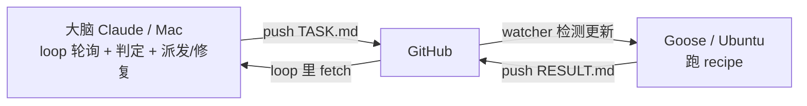

# 实验计划：两节点接力（模拟机械臂 节点1→节点2 / 目标1→目标2）

**目的**：用最简单的 shell 任务，验证「大脑在 loop 里 git 轮询远端结果 → 判定当前节点是否完成 → 完成则推进下一节点，未完成则修复重派」这套编排机制。这是之后真实机械臂项目（[[端到端落地路线图 — 六节点 + 工作循环]] 的 节点1→节点2、目标1→目标2）节点推进的预演。

## 角色与回路

- **大脑（我）**：写/改 TASK.md 并 push；loop 每轮 git 轮询远端 RESULT.md；对照成功标准判定；完成则派发下一节点，未完成则诊断修复。
- **执行端（Goose@Ubuntu）**：`watch-and-run.sh` 检测到远端 TASK.md 更新 → 跑 `supervised-runner.yaml` → 回写 RESULT.md。

## 状态机（我据仓库现状每轮重新推导，不靠记忆）

对齐用两个标记：**TASK.md 顶部 `NODE: k`**（我最后派发的节点）与 **RESULT.md 结论首行 `NODE: k`**（Goose 报告的节点）。

| TASK 的 NODE | RESULT 的 NODE | RESULT 状态 | 我的动作 |
|---|---|---|---|
| k | < k（或无） | — | 本节点结果还没回来 → **等**，本轮结束 |
| k | k | 成功 | 本节点**完成** → 勾选，派发节点 k+1（改 TASK.md、commit、push） |
| k | k | 失败/不达标 | **未完成** → 诊断 RESULT.md，修正 TASK.md（commit、push），留在本节点 |
| 2 | 2 | 成功 | 两节点全完成 → **停止 loop** |

## 节点 1 / 目标 1：建立基线

- **派发内容**：写入 TASK.md（`NODE: 1`），让 Goose 在容器里创建 `node1.txt`，含 `baseline=42`（由 `7*6` 得出）。
- **成功标准（我从 RESULT.md 判定）**：RESULT.md 结论首行 `NODE: 1`；正文能看到 `node1.txt` 内容含 `baseline=42`；各步退出码 0。
- **未完成时的修复**：从 RESULT.md 找出错在哪（命令写错/文件没生成/值不对），改写 TASK.md 对应步骤，重新 push；留在节点1。
- [ ] 节点1 完成

## 节点 2 / 目标 2：基于节点1的产物

- **前提**：节点1已判定完成（容器本地存在 `node1.txt`）。
- **派发内容**：写入 TASK.md（`NODE: 2`），让 Goose 读取 `node1.txt` 的 baseline，加 100，产出 `node2.txt` 含 `result=142`。
- **成功标准**：RESULT.md 结论首行 `NODE: 2`；正文 `node2.txt` 含 `result=142`；退出码 0。
- **未完成时的修复**：同上，诊断并修正 TASK.md 重派；留在节点2。
- [ ] 节点2 完成

> [!note] 为什么节点2能读到节点1的产物
> `node1.txt` 由 Goose 在 Ubuntu 本地创建，recipe 只回传 RESULT.md、不提交 node1.txt，但它作为未跟踪文件**留在同一执行端本地**；节点2在同一容器跑，直接读得到。我这边靠 RESULT.md 里记录的内容来验证。

## Loop 协议（我在 `/loop` 每轮执行）

1. 到 `goose-relay-experiment` 目录，`git fetch origin main`。
2. 读远端 RESULT.md 与本地 TASK.md 的 `NODE` 标记 + RESULT 状态，按上面状态机表判定。
3. 据判定：等 / 派发下一节点 / 修复重派 / 停止。
4. 每轮把「本轮判定与动作」简报给你。

## 手动开跑（前置条件）

1. **Ubuntu 执行端**：tmux 里 `goose config set-mode approve` → `./watch-and-run.sh TASK.md`（常驻监视远端 TASK.md）。
2. **Mac 大脑（我）**：能 push 到该远端（loop 派发节点要 push）。
3. 你运行：`/loop 1m 按 goose-relay-experiment/PLAN.md 的 Loop 协议轮询远端并推进节点`。

## 相关

- [[Goose 监督式命令中继]] — 本实验用的工具与 recipe
- [[端到端落地路线图 — 六节点 + 工作循环]] — 本实验预演的真实项目结构
